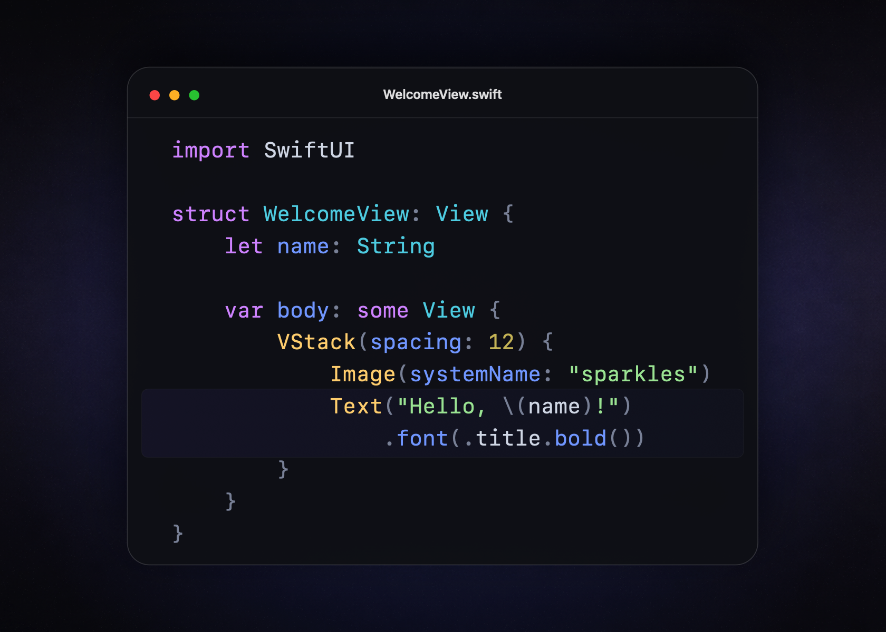

# Rork Highlighter

Rork Highlighter is a SwiftPM-first syntax-highlighting library built on
Tree-sitter. It provides a small Swift API for immutable source strings and an
actor-isolated session API for documents that change over time.



The preview uses the bundled Swift parser and `.rorkDark` theme. The editor
chrome is illustrative.

The package currently bundles a common pack with 36 language definitions. Apps
resolve one Swift package and import one public module instead of managing a
separate SwiftPM dependency for every Tree-sitter grammar.

## Highlights

- Tree-sitter parsing and query-based highlighting.
- Native Swift 6 concurrency and `Sendable` value types.
- Typed `HighlighterError` contracts for highlighting operations.
- Incremental parsing inside one actor per document.
- Explicit UTF-16 ranges that match Foundation text systems.
- Renderer-neutral light and dark themes with hierarchical scope matching.
- Native SwiftUI `AttributedString` and TextKit `NSAttributedString` output.
- Deterministic aliases, filenames, and file-extension discovery.
- Nested-language infrastructure through SwiftTreeSitterLayer.
- A parser-neutral registry for custom and generated language packs.
- One generated Clang target containing all common parser implementations.
- Reproducible grammar updates through exact revisions and locked file hashes.
- Apache-2.0 project code with audited third-party notices.

## Requirements

- Swift 6.0 or newer.
- macOS 13 or newer.
- iOS and Mac Catalyst 16 or newer.
- tvOS 16, watchOS 9, or visionOS 1 when those platforms are relevant.

Tree-sitter and the bundled parser pack also build on supported non-Apple Swift
platforms.

## Installation

Add the package dependency:

```swift
.package(
    url: "https://github.com/rorkai/rork-highlighter.git",
    .upToNextMinor(from: "0.1.0")
)
```

Add the library product to your target:

```swift
.product(
    name: "RorkHighlighter",
    package: "rork-highlighter"
)
```

## One-shot highlighting

Create a highlighter with the bundled catalog and request a snapshot:

```swift
import RorkHighlighter

let highlighter = try Highlighter()
let snapshot = try highlighter.highlight(
    #"{"name":"Rork","enabled":true}"#,
    as: .json
)

for highlight in snapshot.highlights {
    print(highlight.scope, highlight.range)
}
```

The spans preserve Tree-sitter capture names such as
`string.special.key`, `string`, and `constant.builtin`. Spans may overlap.
Apply broader spans first and more specific spans afterward.

Filename and file-extension discovery are also available:

```swift
import Foundation

let snapshot = try highlighter.highlight(
    source,
    for: URL(fileURLWithPath: "/tmp/settings.json")
)
```

## Themes

Resolve highlight spans through a bundled light or dark theme:

```swift
let theme = HighlightTheme.rorkDark

for span in snapshot.highlights {
    let style = theme.style(for: span)
    print(span.range, style)
}
```

Themes are immutable, `Sendable`, and `Codable`. A custom theme supplies a base
style and scope-specific refinements:

```swift
let theme = HighlightTheme(
    name: "Brand",
    baseStyle: HighlightStyle(
        foregroundColor: HighlightColor(rgb: 0xE6_E6_E6),
        textTraits: []
    ),
    styles: [
        "comment": HighlightStyle(
            foregroundColor: HighlightColor(rgb: 0x7A_8A_99),
            textTraits: [.italic]
        ),
        "keyword": HighlightStyle(
            foregroundColor: HighlightColor(rgb: 0xD9_9B_FF)
        ),
    ]
)
```

Scope matching proceeds from broad captures to specific captures. A
`string.special.key` span inherits `string` and `string.special` refinements
before its exact rule is applied.

## Native attributed output

Highlight Swift source and render the snapshot directly in SwiftUI:

```swift
import RorkHighlighter
import SwiftUI

let source = #"""
import SwiftUI

struct WelcomeView: View {
    let name: String

    var body: some View {
        VStack(spacing: 12) {
            Image(systemName: "sparkles")
            Text("Hello, \(name)!")
                .font(.title.bold())
        }
    }
}
"""#

let highlighter = try Highlighter()
let snapshot = try highlighter.highlight(source, as: .swift)
let rendered = try snapshot.attributedString(
    theme: .rorkDark,
    font: .system(size: 15, design: .monospaced)
)

let code = Text(rendered)
    .textSelection(.enabled)
    .padding()
    .background(Color.black)
```

The bundled themes leave `HighlightStyle.backgroundColor` unset. Set the canvas
on the containing view or editor so attributed text does not paint background
strips behind individual text runs.

The renderer uses a monospaced system font by default. Supply any SwiftUI font
when the surrounding interface owns typography:

```swift
let rendered = try snapshot.attributedString(
    theme: .rorkLight,
    font: .system(size: 14, design: .monospaced)
)
```

UIKit and AppKit clients can request an `NSAttributedString` with native
platform colors, fonts, and TextKit keys:

```swift
let rendered = try snapshot.nsAttributedString(
    theme: .rorkDark,
    font: .monospacedSystemFont(ofSize: 14, weight: .regular)
)
```

Assign the result directly to APIs such as `UILabel.attributedText` or
`NSTextStorage.setAttributedString(_:)`.

Rendering preserves the snapshot's UTF-16 ranges and overlap order. Invalid
ranges throw `HighlightRenderingError` instead of being rounded or trapping.
The native APIs are available when SwiftUI, UIKit, or AppKit is present.
Renderer-neutral themes and raw spans remain available on Linux and other
Swift platforms.

## Bundled languages

The standard catalog includes the following definitions:

| Language | Swift identifier | Common aliases | File extensions | Exact filenames |
| --- | --- | --- | --- | --- |
| Astro | `.astro` | | `astro` | |
| Bash | `.bash` | `sh`, `shell` | `bash`, `bats`, `sh`, `zsh` | `.bash_profile`, `.bashrc`, `.profile`, `.zprofile`, `.zshrc` |
| C | `.c` | | `c`, `h` | |
| C++ | `.cpp` | `c++`, `cplusplus`, `cxx` | `cc`, `cpp`, `cxx`, `hh`, `hpp`, `hxx`, `ipp`, `tpp` | |
| CSS | `.css` | | `css` | |
| Dockerfile | `.dockerfile` | `docker` | | `Containerfile`, `Dockerfile` |
| dotenv | `.dotenv` | `env` | `env` | `.env`, `.env.development`, `.env.example`, `.env.local`, `.env.production`, `.env.test` |
| Go | `.go` | `golang` | `go` | |
| GraphQL | `.graphql` | `gql` | `gql`, `graphql`, `graphqls` | |
| Groovy | `.groovy` | | `gradle`, `groovy`, `gsh`, `gvy`, `gy` | |
| HTML | `.html` | `htm` | `htm`, `html`, `xhtml` | |
| Java | `.java` | | `java` | |
| JavaScript | `.javascript` | `js`, `jsx`, `node` | `cjs`, `js`, `jsx`, `mjs` | |
| JSDoc | `.jsdoc` | `js-doc` | | |
| JSON | `.json` | | `geojson`, `json` | `Package.resolved` |
| JSON5 | `.json5` | `jsonc` | `json5`, `jsonc` | `jsconfig.json`, `tsconfig.json` |
| Kotlin | `.kotlin` | `kt`, `kts` | `kt`, `kts` | |
| Markdown | `.markdown` | `md` | `markdown`, `md`, `mdown`, `mkd`, `mkdn` | |
| Markdown Inline | `.markdownInline` | `markdown_inline` | | |
| MDX | `.mdx` | | `mdx` | |
| Objective-C | `.objectiveC` | `obj-c`, `objc` | `m`, `mm` | |
| Java Properties | `.properties` | `java-properties` | `properties` | |
| Python | `.python` | `py` | `py`, `pyi`, `pyw` | |
| Regular Expression | `.regex` | `regexp` | | |
| Ruby | `.ruby` | `rb` | `gemspec`, `podspec`, `rake`, `rb` | `Brewfile`, `Fastfile`, `Gemfile`, `Podfile`, `Rakefile` |
| Rust | `.rust` | `rs` | `rs` | |
| SCSS | `.scss` | | `scss` | |
| SQL | `.sql` | | `sql` | |
| Svelte | `.svelte` | | `svelte` | |
| Swift | `.swift` | `swiftlang` | `swift` | |
| TOML | `.toml` | | `toml` | |
| TSX | `.tsx` | `react-typescript` | `tsx` | |
| TypeScript | `.typescript` | `ts` | `cts`, `mts`, `ts` | |
| Vue | `.vue` | | `vue` | |
| XML | `.xml` | | `plist`, `storyboard`, `svg`, `xib`, `xml` | |
| YAML | `.yaml` | `yml` | `yaml`, `yml` | `Podfile.lock` |

Markdown Inline, JSDoc, and Regular Expression are public because they are real
Tree-sitter definitions. Their primary role is parsing content injected by
Markdown, JavaScript, TypeScript, TSX, and Swift.

## Incremental highlighting

Keep one session for each open document:

```swift
let session = try highlighter.makeSession(source, as: .json)

let update = try await session.replaceCharacters(
    in: UTF16Range(location: 10, length: 1),
    with: #""new value""#
)

render(update.snapshot.highlights)
invalidate(update.invalidatedRanges)
```

The session applies a Tree-sitter edit to the previous syntax tree and reparses
incrementally. It currently returns a complete highlight snapshot together with
the invalidated ranges. A later renderer layer can consume token deltas without
changing the edit API.

## Registering a language

`HighlightLanguage` accepts any compatible generated Tree-sitter parser and its
matching query sources:

```swift
import RorkHighlighter
import TreeSitterSwift

let swift = try HighlightLanguage(
    id: "swift",
    displayName: "Swift",
    aliases: ["swiftlang"],
    fileExtensions: ["swift"],
    filenames: [],
    treeSitterLanguage: tree_sitter_swift(),
    highlightsQuery: swiftHighlightsQuery,
    injectionsQuery: swiftInjectionsQuery
)

let catalog = try LanguageCatalog(languages: [swift])
let highlighter = Highlighter(catalog: catalog)
```

Applications do not need to register bundled languages this way. Direct
registration remains available for private grammars and languages outside the
common pack.

## Language distribution

Official language packs follow three rules:

1. Parser code and query files come from the same pinned upstream revision.
2. Every distributed grammar has an audited permissive license.
3. Apple application builds bundle parser code at build time instead of
   downloading executable parsers.

`CRorkHighlighterParsers` is an internal Clang target. Generated `parser.c` and
`scanner.c` files are compiled native code under that target. Matching
`highlights.scm`, `injections.scm`, and `locals.scm` files are resources in the
public Swift target. Consumers only import `RorkHighlighter`.

## Development

Run the complete validation:

```bash
make check
```

Format maintained Swift sources:

```bash
make format
```

`make check` builds with warnings treated as errors, runs the tests, lints
Swift formatting, verifies the language pack lock, and checks documentation for
Swift and authored C declarations.

Update every bundled parser from its pinned revision:

```bash
make vendor-languages
```

The update command reads `LanguagePack.json`, regenerates the C interface and
Swift catalog, copies exact upstream files, and refreshes
`LanguagePack.lock.json`.

See the package's DocC catalog for API guidance, the
[architecture](Docs/Architecture.md) for the distribution design, the
[roadmap](Docs/Roadmap.md) for planned work, and the
[contribution guide](CONTRIBUTING.md) for maintenance rules. The
[changelog](CHANGELOG.md) records each published release.

## License

Rork Highlighter is licensed under Apache-2.0. Tree-sitter,
SwiftTreeSitter, and bundled grammars retain their original permissive
licenses. See `THIRD_PARTY_NOTICES.md` for exact attribution.
